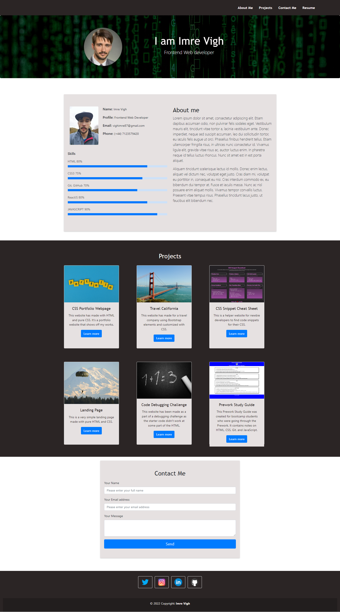

# Bootstrap-Portfolio

## Description
This portfolio webpage is the recreation of my previous portfolio website (https://vighimre87.github.io/Portfolio_Webpage/) with the help of Bootstrap.

## Usage
It doesn't require any installation. As a user you can find a navbar with navigation links to the appropriate part of the webpage. You can also download a resume from the navbar. You can find a Hero section with my profile picture and my name with the position I am applying for. You can also find a Projects section where clicking a button you will be directed to a webpage showing the associated project. At the bottom of the page you will find a contact form and at the footer section you can connect me on different social media channels. Please see the mockup image of the website below:

## Credits
N/A

## License
Plese refer to the LICENSE file in the repo.